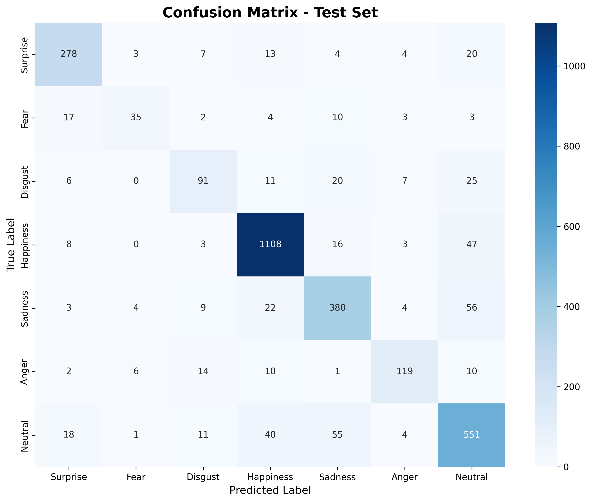
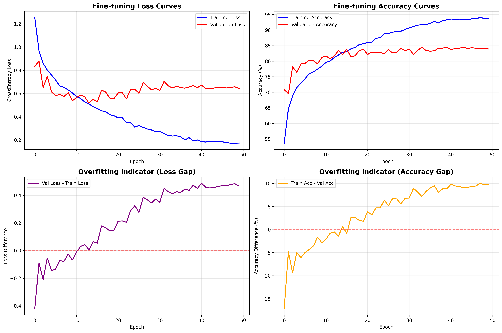

# Training-AI-for-emotion

### 1. Project Overview
- Mô tả ngắn gọn mục tiêu project
- Bài toán: Emotion Recognition / Emotion Classification
- Input (ảnh khuôn mặt / dữ liệu cảm xúc)
- Output (7 class cảm xúc: Surprise, Fear, Disgust, Happiness, Sadness, Anger, Neutral)

### 2. Dataset
- Mô tả dataset sử dụng (FER2013 / custom nếu có)
- Số lượng lớp
- Cách chia Train / Validation / Test
- Các bước tiền xử lý chính (resize, normalization, augmentation nếu có)

### 3. Model Architecture
- Mô tả tổng quan mô hình (CNN / Transfer Learning / Fine-tuning)
- Backbone (nếu có)
- Loss function
- Optimizer
- Learning rate (nếu tìm thấy trong code)

### 4. Training & Fine-tuning
- Quy trình training
- Số epoch
- Chiến lược fine-tuning
- Validation strategy

### 5. Experimental Results
Giải thích dựa trên các hình sau (đã có trong repo / output):

#### a) Confusion Matrix (Test Set)

- Nhận xét lớp nào dự đoán tốt nhất
- Các cặp cảm xúc dễ nhầm lẫn (ví dụ: Sadness ↔ Neutral)
- Nhận xét về class imbalance nếu có

#### b) Loss Curves

- So sánh training loss vs validation loss
- Nhận xét hiện tượng overfitting

#### c) Accuracy Curves
- Xu hướng accuracy
- Khoảng cách train – validation accuracy

#### d) Overfitting Indicators
- Giải thích loss gap và accuracy gap
- Kết luận model có overfit hay không

### 6. Evaluation Summary
- Accuracy cuối cùng trên tập validation/test (ước lượng từ biểu đồ nếu không có số chính xác)
- Nhận xét tổng quan hiệu năng mô hình

### 7. How to Run
- Yêu cầu môi trường (Python, thư viện chính)
- Các bước:
  - Clone repo
  - Cài dependencies
  - Train model
  - Evaluate model
  - Config AWS and deploy (Web / API) at workstation terminal

### 8. Project Structure
- Giải thích ngắn gọn các folder/file quan trọng

### 9. Limitations
- Dataset hạn chế
- Overfitting
- Nhầm lẫn cảm xúc tương đồng

### 10. Future Improvements
- Data augmentation nâng cao
- Class balancing
- Attention / Transformer / Vision Transformer

### 11. Author
- Mai Nguyen Binh Tan
